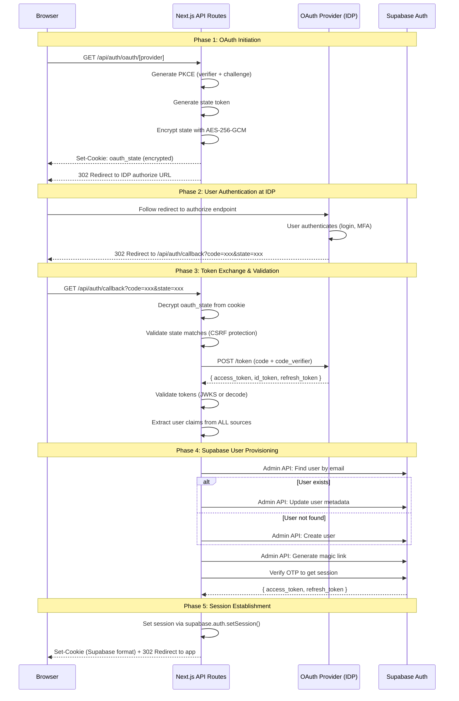

# Add External OAuth Provider

Implements external OAuth2/OIDC identity provider integration where **Next.js acts as the OAuth client**. This is the **required approach** for Buildpad DaaS applications since Supabase is self-hosted and deployment configuration is not accessible.

## When to Use This Skill

Use this skill when:
- Adding SSO/OAuth login to a DaaS application
- Integrating with Azure AD, Okta, Auth0, Google, or any OAuth2/OIDC provider
- Self-hosted Supabase without access to deployment configuration
- Need JIT (Just-In-Time) user provisioning from external IDP

## Architecture Overview



## Design Decisions

### 1. Next.js as OAuth Client (Not Supabase Built-in)

**Rationale**: Self-hosted Supabase deployments don't expose IDP configuration. Next.js handles the full OAuth flow.

| Component | Role |
|-----------|------|
| Next.js API Routes | OAuth client, token exchange, user provisioning |
| External IDP | User authentication, identity assertion |
| Supabase Auth | User database, session management, JWT issuance |

### 2. PKCE Required

**Rationale**: Security best practice. Prevents authorization code interception attacks.

- Use S256 method (SHA-256 hash of code_verifier)
- 32-byte random code_verifier (43 chars base64url)
- code_challenge sent to IDP, code_verifier sent on token exchange

### 3. State Encryption with AES-256-GCM

**Rationale**: Prevent state tampering and store sensitive data (code_verifier) securely.

State payload contains:
- `state`: Random CSRF token
- `codeVerifier`: PKCE verifier (sensitive)
- `provider`: OAuth provider name
- `returnTo`: Post-login redirect URL
- `createdAt`: Timestamp for expiration check

### 4. Multi-Source Claim Extraction

**Critical Learning**: Different OAuth providers return user claims in different places:

| Provider | Primary Claim Source |
|----------|---------------------|
| Azure AD | id_token |
| Google | id_token |
| Okta | id_token or access_token |
| Auth0 | id_token |
| Custom IDPs | Often access_token or userinfo endpoint |

**Implementation**: Check ALL sources in order:
1. Decode access_token as JWT (if not opaque)
2. Validate id_token (if present)
3. Call userinfo endpoint (if configured)
4. Merge all claims, later sources override earlier

### 5. Session via supabase.auth.setSession()

**Critical Learning**: Manually setting `sb-access-token` cookies doesn't work. Supabase SSR client uses a specific cookie format.

**Solution**: Create a Supabase SSR client in the callback route and call `setSession()`:

```typescript
const supabase = createServerClient(url, anonKey, {
  cookies: {
    getAll: () => request.cookies.getAll(),
    setAll: (cookies) => cookies.forEach(c => response.cookies.set(c.name, c.value, c.options)),
  },
});
await supabase.auth.setSession({ access_token, refresh_token });
```

### 6. Email Claim Detection

**Critical Learning**: Providers use different claim names for email:

| Claim Name | Providers |
|------------|-----------|
| `email` | Standard OIDC, Google, Auth0 |
| `preferred_username` | Azure AD (UPN) |
| `upn` | Some enterprise IDPs |
| `mail` | LDAP-style providers |
| `login` | GitHub |
| `username` | Some custom IDPs |

**Implementation**: Check all variants in `normalizeUserClaims()`.

## Issues Encountered & Solutions

### Issue 1: "no_email_claim" Error

**Problem**: ID token didn't contain email claim.

**Root Cause**: Provider returned email in access_token (JWT) instead of id_token.

**Solution**: Decode access_token as JWT and merge claims from all sources:
```typescript
// Try access_token as JWT
const accessTokenClaims = decodeTokenUnsafe(tokens.access_token);
if (accessTokenClaims) {
  allClaims = { ...allClaims, ...accessTokenClaims };
}
```

### Issue 2: Login Loop After OAuth Success

**Problem**: User authenticated successfully (logs showed "User authenticated") but was redirected back to login page.

**Root Cause**: Manually set cookies (`sb-access-token`, `sb-refresh-token`) were not in the format Supabase SSR middleware expects.

**Solution**: Use `supabase.auth.setSession()` from @supabase/ssr client instead of manual cookie setting. The SSR client handles the correct cookie format internally.

### Issue 3: No getUserByEmail in Supabase Admin API

**Problem**: `supabase.auth.admin.getUserByEmail()` doesn't exist.

**Solution**: Paginate through `listUsers()` to find by email:
```typescript
while (!existingUser) {
  const { data } = await supabase.auth.admin.listUsers({ page, perPage: 1000 });
  const found = data?.users.find(u => u.email?.toLowerCase() === email.toLowerCase());
  if (found) existingUser = found;
  if (!data?.users || data.users.length < perPage) break;
  page++;
}
```

## CLI Installation (Recommended)

The entire OAuth implementation is registered as the `external-oauth` lib module in the **microbuild-ui** CLI registry. Install it with one command:

```bash
# Install the external-oauth module (includes all files below)
pnpm cli add-lib external-oauth --cwd .

# Or during bootstrap:
pnpm cli bootstrap --cwd .
# Then install the oauth module separately since it's not included by default:
pnpm cli add-lib external-oauth --cwd .
```

This copies:
- `lib/oauth/config.ts` — provider configs (Azure, Google, Okta, Auth0, Generic)
- `lib/oauth/pkce.ts` — PKCE + AES-256-GCM state encryption
- `lib/oauth/validate.ts` — JWKS token validation + claim normalization
- `lib/oauth/index.ts` — barrel export
- `lib/supabase/admin.ts` — JIT user provisioning via Admin API
- `app/api/auth/oauth/[provider]/route.ts` — OAuth initiation route
- `app/api/auth/callback/route.ts` — Enhanced dual-mode callback (replaces basic version)
- `components/auth/OAuthLoginButtons.tsx` — Login button component

---

## Manual Implementation Steps

Use this when you cannot run the CLI and need to create files from scratch.

### Step 1: Install Dependencies

```bash
pnpm add jose
```

### Step 2: Add Environment Variables

```env
# ═══════════════════════════════════════════════════════════════════════
# External OAuth Provider Configuration (Next.js as OAuth Client)
# ═══════════════════════════════════════════════════════════════════════

# Required: OAuth State Encryption Secret — generate with: openssl rand -base64 32
OAUTH_STATE_SECRET=your-32-byte-random-secret-here

# Generic / Custom OIDC Provider
OAUTH_CLIENT_ID=your_client_id
OAUTH_CLIENT_SECRET=your_client_secret
OAUTH_AUTHORIZATION_URL=https://idp.example.com/connect/authorize
OAUTH_TOKEN_URL=https://idp.example.com/connect/token
OAUTH_USERINFO_URL=https://idp.example.com/connect/userinfo
OAUTH_JWKS_URI=https://idp.example.com/.well-known/jwks
OAUTH_ISSUER=https://idp.example.com
OAUTH_SCOPES=openid email profile
# Optional: JSON object of extra authorization params e.g. {"prompt":"select_account"}
# OAUTH_AUTH_PARAMS=

# Azure AD / Entra ID
# AZURE_AD_TENANT_ID=your-tenant-id
# AZURE_AD_CLIENT_ID=your_client_id
# AZURE_AD_CLIENT_SECRET=your_client_secret

# Google
# GOOGLE_CLIENT_ID=your_client_id
# GOOGLE_CLIENT_SECRET=your_client_secret

# Okta
# OKTA_DOMAIN=dev-123456.okta.com
# OKTA_CLIENT_ID=your_client_id
# OKTA_CLIENT_SECRET=your_client_secret

# Auth0
# AUTH0_DOMAIN=myapp.auth0.com
# AUTH0_CLIENT_ID=your_client_id
# AUTH0_CLIENT_SECRET=your_client_secret
```

### Step 3: Register Redirect URI with IDP

| Setting | Value |
|---------|-------|
| Redirect URI | `https://your-app.com/api/auth/callback` |
| Grant Type | Authorization Code |
| PKCE | Required (S256) |
| Scopes | `openid email profile` (add `User.Read` for Azure) |

### Step 4: Create OAuth Library Files

**File structure:**
```
lib/oauth/
├── index.ts          # Barrel export
├── config.ts         # Provider configurations (all providers)
├── pkce.ts           # PKCE (RFC 7636) + AES-256-GCM state encryption
└── validate.ts       # JWKS token validation + multi-provider claim normalization

lib/supabase/
└── admin.ts          # Admin client + findOrCreateUser + generateUserSession

app/api/auth/
├── oauth/[provider]/route.ts    # OAuth initiation (PKCE, state cookie, redirect)
└── callback/route.ts            # Dual-mode: external OAuth + Supabase fallback

components/auth/
└── OAuthLoginButtons.tsx        # Login button component ('use client')
```

#### `lib/oauth/config.ts`

Defines `OAuthProviderConfig` interface and per-provider factory functions. All IDP settings come from environment variables. `getProviderConfig(provider)` dispatches to the right factory. `validateProviderEnv(provider)` returns missing env vars.

Key providers: `generic`, `azure`, `google`, `okta`, `auth0`.

```typescript
export interface OAuthProviderConfig {
  clientId: string;
  clientSecret: string;
  authorizationUrl: string;
  tokenUrl: string;
  userInfoUrl?: string;
  jwksUri?: string;
  issuer?: string;
  scopes: string[];
  authParams?: Record<string, string>;
}

export type SupportedProvider = 'generic' | 'azure' | 'google' | 'okta' | 'auth0';

export function getProviderConfig(provider: string): OAuthProviderConfig { /* ... */ }
export function validateProviderEnv(provider: string): { valid: boolean; missing: string[] } { /* ... */ }
```

#### `lib/oauth/pkce.ts`

PKCE utilities (RFC 7636) + AES-256-GCM state encryption/decryption.

- `generateCodeVerifier()` — 32 random bytes as base64url
- `generateCodeChallenge(verifier)` — SHA-256 hash of verifier, base64url
- `generateState()` — 16 random bytes as hex (CSRF token)
- `encryptState(data)` — AES-256-GCM encrypt object to base64url string
- `decryptState<T>(encrypted)` — decrypt and JSON parse
- `createOAuthState(provider, returnTo)` — creates the full `OAuthStateData` object
- `isStateExpired(stateData)` — checks `createdAt` against 10-minute expiry

```typescript
export interface OAuthStateData {
  state: string;       // CSRF token
  codeVerifier: string; // PKCE verifier
  provider: string;
  returnTo: string;
  createdAt: number;   // ms since epoch
}
```

#### `lib/oauth/validate.ts`

Token validation and claim normalization.

- `validateIdToken(idToken, config)` — uses JWKS if configured, falls back to decode-only
- `decodeTokenUnsafe(token)` — decode JWT without verification (for access_token claim extraction)
- `normalizeUserClaims(claims)` — extracts `email`, `name`, `firstName`, `lastName`, `picture`, `providerId`

`normalizeUserClaims` checks all known email claim variants: `email`, `preferred_username`, `upn`, `mail`, `emailAddress`, `user_email`, `login`, `username`.

#### `lib/supabase/admin.ts`

Admin client singleton + JIT user provisioning.

- `createSupabaseAdmin()` — singleton using `SUPABASE_SERVICE_ROLE_KEY`
- `findOrCreateUser(options)` — paginates `listUsers()` to find by email (no `getUserByEmail` exists!), then creates/updates, generates session via magic link + OTP verification
- `generateUserSession(supabase, user)` — uses `admin.generateLink('magiclink')` + `verifyOtp()` to get real `access_token` / `refresh_token`

```typescript
export async function findOrCreateUser(options: FindOrCreateUserOptions): Promise<UserSessionResult>
// Returns: { user, session: { access_token, refresh_token, ... }, isNewUser }
```

#### `app/api/auth/oauth/[provider]/route.ts`

```typescript
export async function GET(request, { params }) {
  // 1. Validate provider name
  // 2. Validate env vars via validateProviderEnv()
  // 3. createOAuthState() + generateCodeChallenge()
  // 4. encryptState() → set HttpOnly cookie 'oauth_state' (10 min)
  // 5. Build authUrl with PKCE params
  // 6. return NextResponse.redirect(authUrl)
}
```

#### `app/api/auth/callback/route.ts`

Dual-mode: detects `oauth_state` cookie to choose external vs. Supabase flow.

```typescript
export async function GET(request) {
  // External OAuth path (oauth_state cookie present):
  // 1. Decrypt + validate state (CSRF check + expiry)
  // 2. POST to tokenUrl: code + code_verifier → { access_token, id_token, refresh_token }
  // 3. Merge claims from: decodeTokenUnsafe(access_token) + validateIdToken(id_token) + userinfo endpoint
  // 4. normalizeUserClaims() → email, name, etc.
  // 5. findOrCreateUser() → Supabase user + session
  // 6. createServerClient() + supabase.auth.setSession() → sets cookies in correct format
  // 7. NextResponse.redirect(oauthState.returnTo)

  // Supabase native fallback (no cookie):
  // supabase.auth.exchangeCodeForSession(code)
}
```

**Critical**: use `supabase.auth.setSession()` from `@supabase/ssr` `createServerClient` — do NOT manually set `sb-access-token` cookies. The SSR client sets the correct format the middleware recognises.

#### `components/auth/OAuthLoginButtons.tsx`

```tsx
'use client';
// Reads ?error= from URL for error display
// Renders Button per provider, onClick → window.location.href = '/api/auth/oauth/[id]?returnTo=...'
// Hides 'generic' SSO button when specific providers (azure/google) are also shown
export function OAuthLoginButtons({ providers?, returnTo?, showDivider? }) {}
```

### Step 5: Add Login UI

```tsx
import { OAuthLoginButtons } from '@/components/auth/OAuthLoginButtons';

// In your login page:
<OAuthLoginButtons showDivider />

// Show only specific providers:
<OAuthLoginButtons providers={['azure', 'google']} returnTo="/dashboard" />
```

## Security Considerations

### 1. State Secret

Generate a cryptographically strong secret:
```bash
openssl rand -base64 32
```

### 2. Service Role Key Protection

`SUPABASE_SERVICE_ROLE_KEY` bypasses RLS. Only use in server-side API routes.

### 3. Token Validation

Always configure JWKS for cryptographic verification when available:
```env
OAUTH_JWKS_URI=https://idp.example.com/.well-known/jwks
OAUTH_ISSUER=https://idp.example.com
```

### 4. Cookie Security

Production cookies:
- `HttpOnly`: Prevents XSS access
- `Secure`: HTTPS only
- `SameSite=Lax`: CSRF protection

## Troubleshooting

### "no_email_claim"

**Causes**:
1. Email not in id_token (check access_token or userinfo)
2. Wrong scope requested (ensure `email` scope)
3. Provider uses non-standard claim name

**Debug**: Check terminal logs for "Merged claims" to see all available claims.

### "state_mismatch"

**Causes**:
1. Cookie blocked (third-party cookies disabled)
2. Multiple browser tabs initiated OAuth
3. State expired (>10 minutes)

### Login Loop

**Causes**:
1. Session cookies not set in correct format
2. Middleware not recognizing session

**Solution**: Ensure using `supabase.auth.setSession()` not manual cookie setting.

## References

- [OAuth 2.0 RFC 6749](https://datatracker.ietf.org/doc/html/rfc6749)
- [PKCE RFC 7636](https://datatracker.ietf.org/doc/html/rfc7636)
- [Supabase Admin API](https://supabase.com/docs/reference/javascript/admin-api)
- [Supabase SSR](https://supabase.com/docs/guides/auth/server-side/nextjs)
