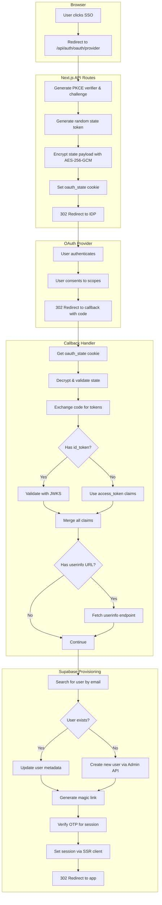
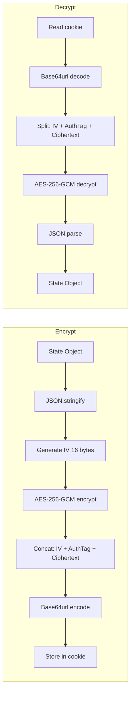

# External OAuth Implementation Details

Detailed technical reference for implementing external OAuth with Next.js as OAuth client.

## OAuth Flow Diagram



## Token Claim Extraction Strategy

```mermaid
flowchart LR
    subgraph Sources["Claim Sources (in order)"]
        S1[1. access_token as JWT]
        S2[2. id_token JWT]
        S3[3. userinfo endpoint]
    end

    subgraph Merge["Claim Merging"]
        S1 --> M[allClaims = {}]
        S2 --> M
        S3 --> M
        M --> N["Later sources override<br/>earlier sources"]
    end

    subgraph Extract["Extract User Info"]
        N --> E1[email: check 8 claim names]
        N --> E2[name: check multiple formats]
        N --> E3[providerId: use 'sub' claim]
    end
```

## PKCE Implementation

### Code Verifier Generation

```typescript
import crypto from 'crypto';

// Generate 32 bytes of random data
// Base64url encoded = 43 characters
// Meets RFC 7636 requirement of 43-128 characters
export function generateCodeVerifier(): string {
  return crypto.randomBytes(32).toString('base64url');
}
```

### Code Challenge Generation (S256)

```typescript
// SHA-256 hash of verifier, base64url encoded
export function generateCodeChallenge(verifier: string): string {
  return crypto
    .createHash('sha256')
    .update(verifier)
    .digest('base64url');
}
```

## State Encryption

### Data Flow



### State Payload Structure

```typescript
interface OAuthStateData {
  state: string;        // Random CSRF token (sent to IDP)
  codeVerifier: string; // PKCE verifier (sensitive, never sent to IDP)
  provider: string;     // e.g., 'generic', 'azure'
  returnTo: string;     // Post-login redirect URL
  createdAt: number;    // Unix timestamp for expiration check
}
```

### Encryption Implementation

```typescript
import crypto from 'crypto';

const ALGORITHM = 'aes-256-gcm';
const IV_LENGTH = 16;
const AUTH_TAG_LENGTH = 16;

function deriveKey(): Buffer {
  const secret = process.env.OAUTH_STATE_SECRET;
  return crypto.scryptSync(secret, 'oauth-state-salt', 32);
}

export function encryptState<T>(data: T): string {
  const key = deriveKey();
  const iv = crypto.randomBytes(IV_LENGTH);
  const cipher = crypto.createCipheriv(ALGORITHM, key, iv);
  
  const plaintext = JSON.stringify(data);
  const encrypted = Buffer.concat([
    cipher.update(plaintext, 'utf8'),
    cipher.final(),
  ]);
  const authTag = cipher.getAuthTag();
  
  // Format: IV (16) + AuthTag (16) + Ciphertext
  return Buffer.concat([iv, authTag, encrypted]).toString('base64url');
}

export function decryptState<T>(encoded: string): T {
  const key = deriveKey();
  const buffer = Buffer.from(encoded, 'base64url');
  
  const iv = buffer.subarray(0, IV_LENGTH);
  const authTag = buffer.subarray(IV_LENGTH, IV_LENGTH + AUTH_TAG_LENGTH);
  const ciphertext = buffer.subarray(IV_LENGTH + AUTH_TAG_LENGTH);
  
  const decipher = crypto.createDecipheriv(ALGORITHM, key, iv);
  decipher.setAuthTag(authTag);
  
  const decrypted = Buffer.concat([
    decipher.update(ciphertext),
    decipher.final(),
  ]);
  
  return JSON.parse(decrypted.toString('utf8'));
}
```

## Token Validation

### With JWKS (Recommended)

```typescript
import * as jose from 'jose';

// Cache JWKS for performance
const jwksCache = new Map<string, jose.JWTVerifyGetKey>();

async function validateWithJwks(
  idToken: string,
  jwksUri: string,
  issuer: string,
  audience: string
): Promise<{ valid: boolean; claims?: any; error?: string }> {
  // Get or create cached JWKS resolver
  let jwks = jwksCache.get(jwksUri);
  if (!jwks) {
    jwks = jose.createRemoteJWKSet(new URL(jwksUri));
    jwksCache.set(jwksUri, jwks);
  }

  const { payload } = await jose.jwtVerify(idToken, jwks, {
    issuer,
    audience,
  });

  return { valid: true, claims: payload };
}
```

### Without JWKS (Fallback - Less Secure)

```typescript
import * as jose from 'jose';

function decodeTokenUnsafe(token: string): any | null {
  try {
    const payload = jose.decodeJwt(token);
    
    // Validate expiration even without signature verification
    if (payload.exp && payload.exp < Date.now() / 1000) {
      return null; // Expired
    }
    
    return payload;
  } catch {
    return null; // Not a valid JWT
  }
}
```

## Email Claim Normalization

```typescript
export function normalizeUserClaims(claims: Record<string, unknown>) {
  // Check multiple claim names for email
  const email = 
    claims.email ||              // Standard OIDC
    claims.preferred_username || // Azure AD UPN
    claims.upn ||                // Some enterprise IDPs
    claims.mail ||               // LDAP-style
    claims.emailAddress ||       // Some providers
    claims.user_email ||         // Custom
    claims.login ||              // GitHub
    claims.username;             // Fallback

  // Parse name from various formats
  let firstName = claims.given_name as string | undefined;
  let lastName = claims.family_name as string | undefined;

  if (claims.name && (!firstName || !lastName)) {
    const parts = (claims.name as string).split(' ');
    if (!firstName) firstName = parts[0];
    if (!lastName) lastName = parts.slice(1).join(' ') || undefined;
  }

  return {
    email: email as string | undefined,
    emailVerified: (claims.email_verified ?? true) as boolean,
    name: claims.name as string | undefined,
    firstName,
    lastName,
    picture: claims.picture as string | undefined,
    providerId: claims.sub as string,
  };
}
```

## Supabase User Provisioning

### Finding User by Email

```typescript
// Note: Supabase Admin API doesn't have getUserByEmail
// Must paginate through listUsers

async function findUserByEmail(
  supabase: SupabaseClient,
  email: string
): Promise<User | null> {
  let page = 1;
  const perPage = 1000;

  while (true) {
    const { data, error } = await supabase.auth.admin.listUsers({
      page,
      perPage,
    });

    if (error) throw new Error(`Failed to list users: ${error.message}`);

    const found = data?.users.find(
      (u) => u.email?.toLowerCase() === email.toLowerCase()
    );
    
    if (found) return found;
    if (!data?.users || data.users.length < perPage) return null;
    
    page++;
  }
}
```

### Creating New User

```typescript
const { data, error } = await supabase.auth.admin.createUser({
  email: userEmail,
  email_confirm: true, // Trust IDP's verification
  user_metadata: {
    full_name: userInfo.name,
    first_name: userInfo.firstName,
    last_name: userInfo.lastName,
    avatar_url: userInfo.picture,
    linked_providers: [{
      provider: 'generic',
      provider_id: userInfo.providerId,
      linked_at: new Date().toISOString(),
    }],
  },
  app_metadata: {
    provider: 'generic',
    providers: ['generic'],
  },
});
```

### Generating Session (Magic Link Workaround)

```typescript
// Supabase Admin API doesn't have direct session creation
// Workaround: Generate + verify magic link

// Step 1: Generate magic link (email not actually sent)
const { data: linkData, error: linkError } = 
  await supabase.auth.admin.generateLink({
    type: 'magiclink',
    email: user.email!,
  });

if (linkError || !linkData?.properties?.hashed_token) {
  throw new Error('Failed to generate session');
}

// Step 2: Verify the token to create session
const { data: sessionData, error: sessionError } = 
  await supabase.auth.verifyOtp({
    token_hash: linkData.properties.hashed_token,
    type: 'magiclink',
  });

if (sessionError || !sessionData?.session) {
  throw new Error('Failed to create session');
}

// sessionData.session contains access_token, refresh_token
```

## Setting Session Cookies (Critical)

### Wrong Way (Causes Login Loop)

```typescript
// ❌ DON'T DO THIS - cookies won't be recognized by Supabase middleware
response.cookies.set('sb-access-token', session.access_token, {
  httpOnly: true,
  secure: true,
  sameSite: 'lax',
  maxAge: 3600,
  path: '/',
});
```

### Correct Way (Use SSR Client)

```typescript
import { createServerClient } from '@supabase/ssr';

// ✅ DO THIS - Supabase SSR handles cookie format internally
const supabase = createServerClient(
  process.env.NEXT_PUBLIC_SUPABASE_URL!,
  process.env.NEXT_PUBLIC_SUPABASE_ANON_KEY!,
  {
    cookies: {
      getAll() {
        return request.cookies.getAll();
      },
      setAll(cookiesToSet) {
        cookiesToSet.forEach(({ name, value, options }) => {
          response.cookies.set(name, value, options);
        });
      },
    },
  }
);

// This sets cookies in the correct format
const { error } = await supabase.auth.setSession({
  access_token: session.access_token,
  refresh_token: session.refresh_token,
});
```

## Provider-Specific Configuration

### Azure AD

```typescript
const config = {
  authorizationUrl: `https://login.microsoftonline.com/${tenantId}/oauth2/v2.0/authorize`,
  tokenUrl: `https://login.microsoftonline.com/${tenantId}/oauth2/v2.0/token`,
  jwksUri: `https://login.microsoftonline.com/${tenantId}/discovery/v2.0/keys`,
  issuer: `https://login.microsoftonline.com/${tenantId}/v2.0`,
  scopes: ['openid', 'email', 'profile', 'offline_access'],
};

// Tenant options:
// - 'common': Any Azure AD + personal Microsoft accounts
// - 'organizations': Any Azure AD only
// - 'consumers': Personal Microsoft accounts only
// - '{tenant-id}': Specific tenant only
```

### Google

```typescript
const config = {
  authorizationUrl: 'https://accounts.google.com/o/oauth2/v2/auth',
  tokenUrl: 'https://oauth2.googleapis.com/token',
  jwksUri: 'https://www.googleapis.com/oauth2/v3/certs',
  issuer: 'https://accounts.google.com',
  scopes: ['openid', 'email', 'profile'],
  // For refresh tokens:
  authParams: { access_type: 'offline', prompt: 'consent' },
};
```

### Okta

```typescript
const config = {
  authorizationUrl: `https://${domain}/oauth2/default/v1/authorize`,
  tokenUrl: `https://${domain}/oauth2/default/v1/token`,
  userInfoUrl: `https://${domain}/oauth2/default/v1/userinfo`,
  jwksUri: `https://${domain}/oauth2/default/v1/keys`,
  issuer: `https://${domain}/oauth2/default`,
  scopes: ['openid', 'email', 'profile'],
};
```

## Debugging Guide

### Enable Verbose Logging

The callback route includes detailed logging. Check terminal for:

```
OAuth: Tokens received: { has_id_token: true, has_access_token: true, ... }
OAuth: Access token claims: { sub: "...", email: "...", ... }
OAuth: ID token claims: { sub: "...", email: "...", ... }
OAuth: UserInfo endpoint claims: { sub: "...", email: "...", ... }
OAuth: Merged claims: { ... all claims ... }
OAuth: User authenticated - user@example.com (generic)
OAuth: Created new user - uuid-xxx
OAuth: Session set successfully, redirecting to: /
```

### Common Issues Checklist

| Symptom | Check |
|---------|-------|
| "no_email_claim" | Look at "Merged claims" log - what claim name has email? |
| "state_mismatch" | Cookie blocked? Multiple tabs? |
| Login loop | Using `setSession()` not manual cookies? |
| "Failed to generate session" | SUPABASE_SERVICE_ROLE_KEY correct? |
| "Token validation failed" | JWKS_URI and ISSUER configured correctly? |
