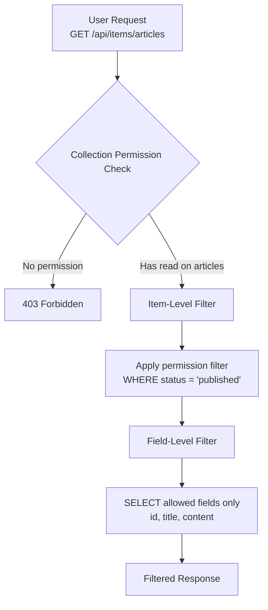
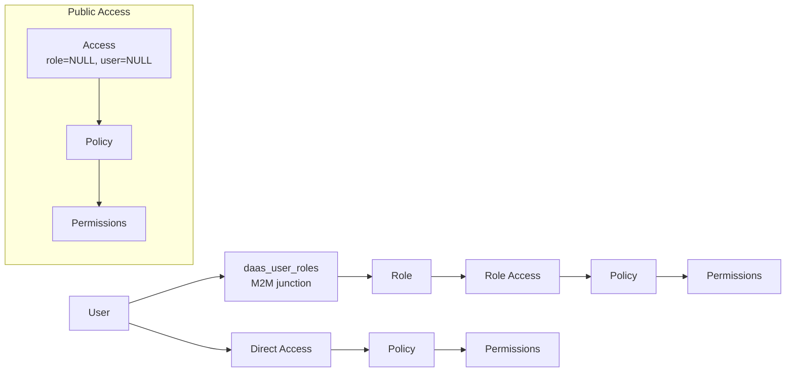

# Permissions and Filtering

This guide covers the DaaS permission system including item-level filtering and field-level permissions.

## Overview

DaaS uses a **policy-based permission model** with three layers of access control:

1. **Collection-Level**: Can the user access this collection at all?
2. **Item-Level**: Which specific records can the user access?
3. **Field-Level**: Which fields can the user see/modify?

### Permission Flow



### Flow Steps

1. **User makes request**: `GET /api/items/articles`
2. **Collection permission check**: Does user have 'read' on 'articles'?
   - ❌ No → 403 Forbidden
   - ✅ Yes → Continue
3. **Item-level filter applied**: Permission filter `{ "status": { "_eq": "published" } }` becomes `WHERE status = 'published'`
4. **Field-level filter applied**: Allowed fields `['id', 'title', 'content']` becomes `SELECT id, title, content` (excludes `author_notes`)
5. **Filtered response returned**

---

## Permission Model Structure

### Core Tables

| Table              | Purpose                       |
| ------------------ | ----------------------------- |
| `daas_users`       | User accounts                 |
| `daas_roles`       | Role definitions              |
| `daas_policies`    | Permission policy containers  |
| `daas_permissions` | Actual permission rules       |
| `daas_access`      | Links users/roles to policies |

### Relationships



A user gets permissions from:

| Source              | Path                                                                    |
| ------------------- | ----------------------------------------------------------------------- |
| **Role policies**   | `daas_user_roles` (all rows) → `access.role` → `policy` → `permissions` |
| **Direct policies** | `access.user` → `policy` → `permissions`                                |
| **Public policies** | `access.role=NULL AND access.user=NULL` → `policy` → `permissions`      |

> Users can belong to **multiple roles** via the `daas_user_roles` junction table.
> Permissions from ALL assigned roles are collected and merged with OR logic.

---

## Item-Level Filtering

Item-level filters restrict which records a user can access within a collection.

### How It Works

1. Permissions can include a `permissions` field (JSON filter)
2. When querying, all applicable filters are combined with **OR logic**
3. The combined filter is applied as a WHERE clause

### Filter in Permission Record

```json
{
  "id": "permission-uuid",
  "policy": "policy-uuid",
  "collection": "articles",
  "action": "read",
  "permissions": {
    "status": { "_eq": "published" }
  },
  "fields": ["*"]
}
```

### Multiple Permissions = OR Logic

If a user has multiple permissions for the same collection/action:

```json
// Permission 1: Can read published articles
{ "status": { "_eq": "published" } }

// Permission 2: Can read own drafts
{ "_and": [
  { "status": { "_eq": "draft" } },
  { "author": { "_eq": "$CURRENT_USER" } }
]}

// Combined (automatically by system):
{
  "_or": [
    { "status": { "_eq": "published" } },
    { "_and": [
      { "status": { "_eq": "draft" } },
      { "author": { "_eq": "$CURRENT_USER" } }
    ]}
  ]
}
```

**Result**: User can see published articles OR their own drafts.

### Full Access (`null` filter) Always Wins

A permission with `permissions: null` means unrestricted access to all items. When merging:

- If **any** of the user's permissions for an action has `null` filter → the result is `null` (full access)
- A restrictive filter from one role **cannot** override a full-access grant from another role

```json
// Role A — full read (null filter)
{ "action": "read", "permissions": null }

// Role B — filtered read
{ "action": "read", "permissions": { "status": { "_eq": "published" } } }

// Combined result → null (full access wins)
```

> This is consistent with OR semantics: `true OR (condition)` = `true`.

### Dynamic Variables

Use these variables in permission filters, presets, and validation:

| Variable                           | Type        | Resolves To                                                                |
| ---------------------------------- | ----------- | -------------------------------------------------------------------------- |
| `$CURRENT_USER`                    | `string`    | Current user's UUID                                                        |
| `$CURRENT_USER.<field>`            | `any`       | A field on the current user record (e.g., `$CURRENT_USER.organization`)    |
| `$CURRENT_USER.<relation>.<field>` | `any`       | Nested relation field (e.g., `$CURRENT_USER.role.name`)                    |
| `$CURRENT_ROLE`                    | `string`    | User's **primary** role UUID (lowest `sort` in `daas_user_roles` junction) |
| `$CURRENT_ROLES`                   | `string[]`  | Array of **all** role UUIDs for the user (all rows in `daas_user_roles`)   |
| `$CURRENT_POLICIES`                | `string[]`  | Array of **all** policy UUIDs for the user                                 |
| `$NOW`                             | `timestamp` | Current timestamp (ISO 8601)                                               |

> **Multi-role users**: Users can belong to multiple roles via the `daas_user_roles` M2M junction
> table. Use `$CURRENT_ROLES` (array) with the `_in` operator when writing filters that must
> match any of a user's roles.

#### Variable Resolution

Dynamic variables are resolved at query-time by the permission enforcer (`lib/permissions/enforcer.ts`):

- **Scalar variables** (`$CURRENT_USER`, `$CURRENT_ROLE`, `$NOW`) resolve to a single value
- **Array variables** (`$CURRENT_ROLES`, `$CURRENT_POLICIES`) resolve to arrays — use with `_in` operator
- **Nested paths** (`$CURRENT_USER.organization`) traverse relations on `daas_users` by querying the related field

```
$CURRENT_USER.organization  →  SELECT organization FROM daas_users WHERE id = <user>
$CURRENT_USER.role.name     →  JOIN daas_user_roles ON user_roles.user_id = <user>
                               JOIN daas_roles ON roles.id = user_roles.role_id → roles.name
                               (resolves via the daas_user_roles junction table, primary role = lowest sort)
```

**Example: Users can only see their own records**

```json
{
  "user_created": { "_eq": "$CURRENT_USER" }
}
```

**Example: Users can only see records from their role**

```json
{
  "assigned_role": { "_eq": "$CURRENT_ROLE" }
}
```

**Note on tenant/org isolation:** Do not implement tenant isolation through permission filters. Use the DaaS scope system (`/manage-scope`) — it handles isolation at the platform level without permission filter workarounds.

**Example: Filter by any of user's roles**

```json
{
  "target_role": { "_in": "$CURRENT_ROLES" }
}
```

**Example: Time-based access (published before now)**

```json
{
  "publish_date": { "_lte": "$NOW" }
}
```

### Filter Operators Reference

| Operator       | Description                 | Example                                         |
| -------------- | --------------------------- | ----------------------------------------------- |
| `_eq`          | Equals                      | `{ "status": { "_eq": "active" } }`             |
| `_neq`         | Not equals                  | `{ "status": { "_neq": "archived" } }`          |
| `_lt`          | Less than                   | `{ "priority": { "_lt": 5 } }`                  |
| `_lte`         | Less than or equal          | `{ "priority": { "_lte": 5 } }`                 |
| `_gt`          | Greater than                | `{ "priority": { "_gt": 0 } }`                  |
| `_gte`         | Greater than or equal       | `{ "priority": { "_gte": 1 } }`                 |
| `_in`          | In array                    | `{ "status": { "_in": ["a", "b"] } }`           |
| `_nin`         | Not in array                | `{ "status": { "_nin": ["x", "y"] } }`          |
| `_null`        | Is null                     | `{ "deleted_at": { "_null": true } }`           |
| `_nnull`       | Is not null                 | `{ "published_at": { "_nnull": true } }`        |
| `_contains`    | Contains (case-sensitive)   | `{ "title": { "_contains": "news" } }`          |
| `_icontains`   | Contains (case-insensitive) | `{ "title": { "_icontains": "news" } }`         |
| `_starts_with` | Starts with                 | `{ "code": { "_starts_with": "PRJ-" } }`        |
| `_ends_with`   | Ends with                   | `{ "email": { "_ends_with": "@company.com" } }` |
| `_empty`       | Is empty (array/string)     | `{ "tags": { "_empty": true } }`                |
| `_nempty`      | Is not empty                | `{ "tags": { "_nempty": true } }`               |
| `_and`         | Logical AND                 | `{ "_and": [filter1, filter2] }`                |
| `_or`          | Logical OR                  | `{ "_or": [filter1, filter2] }`                 |

### Relational Filters

Filter by related record fields:

```json
// Articles where author has role 'editor'
{
  "author": {
    "role": { "_eq": "editor-role-uuid" }
  }
}

// Products in category 'electronics'
{
  "category": {
    "name": { "_eq": "electronics" }
  }
}
```

---

## Field-Level Permissions

Field-level permissions control which columns a user can read or write.

### Configuration

The `fields` property in a permission record lists allowed fields:

```json
{
  "collection": "daas_users",
  "action": "read",
  "fields": ["id", "email", "first_name", "last_name", "avatar"],
  "permissions": null
}
```

### Wildcard Access

Use `*` for all fields:

```json
{
  "collection": "articles",
  "action": "read",
  "fields": ["*"]
}
```

### Field Merging (Multiple Permissions)

When a user has multiple permissions, fields are **merged (union)**:

```json
// Permission 1: fields = ["id", "title", "content"]
// Permission 2: fields = ["id", "author", "status"]
// Result: ["id", "title", "content", "author", "status"]
```

### Read vs Write Fields

Permissions are action-specific:

```json
// Can read all fields
{
  "action": "read",
  "fields": ["*"]
}

// Can only update title and content (not status)
{
  "action": "update",
  "fields": ["title", "content"]
}
```

### Response Filtering

When reading data, responses are automatically filtered:

```json
// Database record
{
  "id": "123",
  "title": "Article",
  "content": "...",
  "author_notes": "Internal only",
  "password_hash": "secret"
}

// User's allowed fields: ["id", "title", "content"]

// Filtered response
{
  "id": "123",
  "title": "Article",
  "content": "..."
}
```

### Write Validation

When creating/updating, forbidden fields are rejected:

```json
// Request
PATCH /api/items/articles/123
{ "title": "New Title", "admin_only_field": "hacked" }

// User's update fields: ["title", "content"]

// Response: 403 Forbidden
{
  "errors": [{
    "message": "You don't have permission to update field: admin_only_field",
    "extensions": { "code": "FORBIDDEN" }
  }]
}
```

---

## Common Permission Patterns

### 1. Self-Access Pattern

Users can only access their own records:

```json
{
  "collection": "user_profiles",
  "action": "read",
  "permissions": {
    "user_id": { "_eq": "$CURRENT_USER" }
  },
  "fields": ["*"]
}
```

### 2. Status-Based Access

Users can see published content, authors see their drafts:

```json
// Public policy - published only
{
  "collection": "articles",
  "action": "read",
  "permissions": {
    "status": { "_eq": "published" }
  }
}

// Author policy - own content
{
  "collection": "articles",
  "action": "read",
  "permissions": {
    "author": { "_eq": "$CURRENT_USER" }
  }
}
```

### 3. Team/Organization Scoping

Users can only see records from their organization:

```json
{
  "collection": "projects",
  "action": "read",
  "permissions": {
    "organization": {
      "members": {
        "user_id": { "_eq": "$CURRENT_USER" }
      }
    }
  }
}
```

### 4. Read-Only Sensitive Fields

Full read access, but limited write access:

```json
// Read all fields
{
  "action": "read",
  "fields": ["*"]
}

// Can only update non-sensitive fields
{
  "action": "update",
  "fields": ["title", "content", "tags"]
  // Cannot update: status, author, admin_notes
}
```

### 5. Admin Full Access

Admin policy with no restrictions:

```json
{
  "collection": "articles",
  "action": "read",
  "permissions": null, // No item filter
  "fields": ["*"] // All fields
}
```

---

## Creating Permissions via API

### Create a Policy

```bash
curl -X POST http://localhost:3000/api/policies \
  -H "Authorization: Bearer <admin_token>" \
  -H "Content-Type: application/json" \
  -d '{
    "name": "Article Viewer",
    "description": "Can view published articles"
  }'
```

### Add Permission to Policy

```bash
curl -X POST http://localhost:3000/api/permissions \
  -H "Authorization: Bearer <admin_token>" \
  -H "Content-Type: application/json" \
  -d '{
    "policy": "policy-uuid",
    "collection": "articles",
    "action": "read",
    "permissions": {
      "status": { "_eq": "published" }
    },
    "fields": ["id", "title", "content", "author", "published_at"]
  }'
```

### Assign Policy to Role

```bash
curl -X POST http://localhost:3000/api/access \
  -H "Authorization: Bearer <admin_token>" \
  -H "Content-Type: application/json" \
  -d '{
    "role": "role-uuid",
    "policy": "policy-uuid"
  }'
```

### Assign Policy to User (Direct)

```bash
curl -X POST http://localhost:3000/api/access \
  -H "Authorization: Bearer <admin_token>" \
  -H "Content-Type: application/json" \
  -d '{
    "user": "user-uuid",
    "policy": "policy-uuid"
  }'
```

---

## Creating Permissions via MCP

AI agents can use MCP tools to manage permissions:

```json
{
  "jsonrpc": "2.0",
  "id": 1,
  "method": "tools/call",
  "params": {
    "name": "permissions",
    "arguments": {
      "action": "create",
      "data": [
        {
          "policy": "policy-uuid",
          "collection": "articles",
          "action": "read",
          "permissions": {
            "status": { "_eq": "published" }
          },
          "fields": ["*"]
        }
      ]
    }
  }
}
```

---

## Frontend Implementation

When building UI that respects permissions:

### Check Permission Before Action

```typescript
// Check if user can create articles
const canCreate = await checkPermission("articles", "create");

if (canCreate) {
  showCreateButton();
}
```

### Filter Fields in Forms

```typescript
// Get allowed fields for editing
const allowedFields = await getPermissionFields("articles", "update");

// Only render editable fields
const editableFields = allFields.filter((f) => allowedFields.includes(f.field));
```

### Handle Permission Errors

```typescript
try {
  await updateItem("articles", id, data);
} catch (error) {
  if (error.extensions?.code === "FORBIDDEN") {
    showToast("You do not have permission to update this field");
  }
}
```

---

## Related Instructions

- See [daas-api.instructions.md](../../daas-platform/references/daas-api.instructions.md) for API endpoint reference
- See [daas-mcp-tools.instructions.md](../../daas-platform/references/daas-mcp-tools.instructions.md) for MCP-based permission management
- See [workflow-versioning.instructions.md](../../create-workflow/references/workflow-versioning.instructions.md) for workflow policy integration
