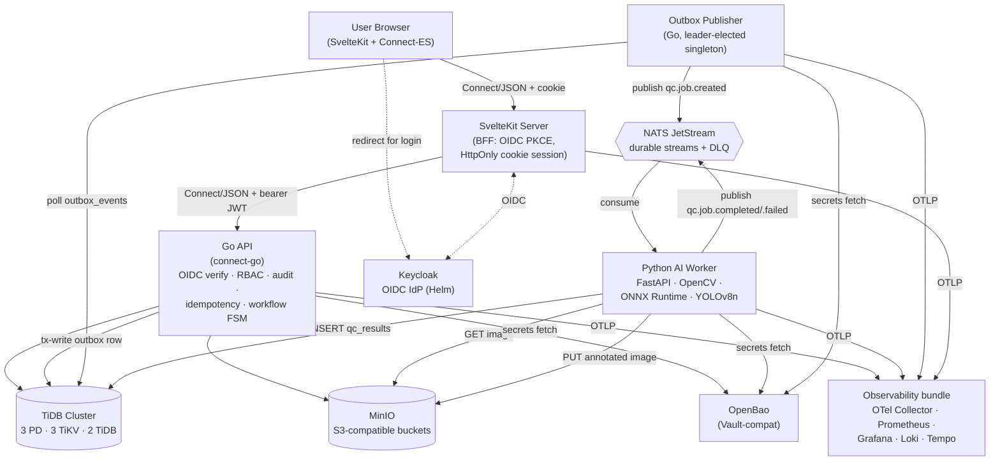

# SimaOps AI — Design

> Reads from: [`requirements.md`](./requirements.md)
> Drives: [`tasks.md`](./tasks.md)

## 1. Architecture



## 2. Repository Layout

```
cyberhack2026/                           # repo root, preserves .kiro/{steering,skills}
  apps/
    web/                                 # SvelteKit + Tailwind + shadcn-svelte + Connect-ES + TanStack Query + Zod + i18n
    api/                                 # Go connect-go API
    ai-worker/                           # Python FastAPI + OpenCV + ONNX + YOLOv8n (strategy: mock|pretrained|custom)
    outbox-publisher/                    # Go singleton, k8s Lease leader election
  proto/simaops/
    lot/v1/lot.proto
    qc/v1/qc.proto
    warehouse/v1/warehouse.proto
    audit/v1/audit.proto
    dashboard/v1/dashboard.proto
    admin/v1/admin.proto
  db/
    migrations/                          # Atlas .sql files
    seed/
      images/{raw_botanical,extract,powder}/
      data.sql
  deploy/
    helm/
      simaops-web/
      simaops-api/
      simaops-ai-worker/
      simaops-outbox-publisher/
    keycloak/
      simaops-realm.json
    k8s/
      base/
      overlays/{dev,staging,production}/
  infra/
    sst/sst.config.ts
    values/{dev,staging,production}.yaml
  docs/
    architecture.md
    api-contract.md
    rbac.md
    audit-log.md
    deployment.md
    demo-script.md
  .github/workflows/
    build.yaml
    deploy-staging.yaml
    deploy-production.yaml
  docker-compose.yml
  buf.yaml
  buf.gen.yaml
  Makefile
  README.md
  package.json                           # root, pnpm workspace
  go.work                                # Go workspace
```

## 3. Service Boundaries

| Service                  | Language | Responsibility                                                                                  |
| ------------------------ | -------- | ----------------------------------------------------------------------------------------------- |
| `apps/web`               | TS       | SvelteKit BFF: OIDC PKCE flow, HttpOnly cookie session, server-side bearer forwarding, UI       |
| `apps/api`               | Go       | Connect RPC handlers; OIDC + RBAC + audit + idempotency middleware; sqlc DB access; outbox writes |
| `apps/ai-worker`         | Python   | NATS JetStream consumer; image fetch + OpenCV + ONNX inference + findings mapping; result write  |
| `apps/outbox-publisher`  | Go       | Singleton via `Lease` leader election; polls `outbox_events`; publishes to NATS; idempotent     |

## 4. Connect RPC Services

Six services (signatures locked in `proto/simaops/{lot,qc,warehouse,audit,dashboard,admin}/v1/*.proto`).

| Service             | Methods                                                                            |
| ------------------- | ---------------------------------------------------------------------------------- |
| `LotService`        | CreateLot, GetLot, ListLots, UpdateLotStatus, GetLotTimeline                       |
| `QCService`         | CreateQCUploadUrl, CreateQCJob, GetQCJob, GetQCResult, ReviewQC, RetryQCJob        |
| `WarehouseService`  | ListLocations, RecommendSlot, AssignSlot, GetWarehouseAssignments                  |
| `AuditService`      | ListAuditLogs, GetEntityAuditTrail                                                 |
| `DashboardService`  | GetOpsDashboard, GetQCMetrics, GetWarehouseMetrics                                 |
| `AdminService`      | ListUsers, AssignRole, RevokeRole, ListRoles                                       |

Mutating RPCs (every `Create*`, `Update*`, `Assign*`, `Review*`, `Retry*`, `Revoke*`) carry an `idempotency_key` field.

## 5. Workflow State Machine

### Lot status

```
DRAFT
 → PENDING_QC
 → AI_PROCESSING
 → QC_REVIEW
 → QC_APPROVED ──┐
 → QC_REJECTED   │
                 ▼
          WAREHOUSE_ASSIGNED
                 ▼
          READY_FOR_PRODUCTION
(BLOCKED is a side-rail any state can transition into)
```

### QC job status

```
QUEUED → PROCESSING → AI_COMPLETED → NEEDS_HUMAN_REVIEW → APPROVED | REJECTED | FAILED
```

### Transition rules

- Only `OPERATOR` or `ADMIN` may create lot or upload QC image.
- Only `QC_SUPERVISOR` or `ADMIN` may approve / reject / recheck QC.
- Only `WAREHOUSE_STAFF` or `ADMIN` may assign a slot.
- Lot cannot reach `WAREHOUSE_ASSIGNED` before `QC_APPROVED`; cannot reach `READY_FOR_PRODUCTION` before `WAREHOUSE_ASSIGNED`.
- Manual override of an AI recommendation requires a non-empty `reason`.
- Every state-changing RPC writes an audit-log row.
- Every mutating RPC is idempotent on `(user_id, operation, idempotency_key)`.

## 6. Domain Entity Shapes (key tables)

### `lots`

```sql
CREATE TABLE lots (
  id              VARCHAR(36)  PRIMARY KEY,
  lot_number      VARCHAR(64)  NOT NULL UNIQUE,                -- LOT-YYYY-MMDD-XXX
  supplier_name   VARCHAR(255) NOT NULL,
  material_name   VARCHAR(255) NOT NULL,
  material_type   ENUM('RAW_BOTANICAL','EXTRACT','POWDER','OTHER') NOT NULL,
  quantity        DECIMAL(14,3) NOT NULL,
  unit            VARCHAR(16)   NOT NULL,                      -- kg, L, ...
  arrival_date    DATE          NOT NULL,
  storage_requirement JSON      NOT NULL,                      -- { temperature_range, hazard_class }
  status          ENUM('DRAFT','PENDING_QC','AI_PROCESSING','QC_REVIEW',
                       'QC_APPROVED','QC_REJECTED','WAREHOUSE_ASSIGNED',
                       'READY_FOR_PRODUCTION','BLOCKED') NOT NULL DEFAULT 'DRAFT',
  created_by      VARCHAR(64)  NOT NULL,
  created_at      TIMESTAMP    DEFAULT CURRENT_TIMESTAMP,
  updated_at      TIMESTAMP    DEFAULT CURRENT_TIMESTAMP ON UPDATE CURRENT_TIMESTAMP,
  INDEX idx_status (status),
  INDEX idx_material_type (material_type)
);
```

`storage_requirement` JSON shape:

```json
{
  "temperature_range": "ambient | cold | deep_freeze",
  "hazard_class":      "null | IBC | IPPC"
}
```

### `warehouse_locations`

```sql
CREATE TABLE warehouse_locations (
  id                  VARCHAR(36) PRIMARY KEY,
  code                VARCHAR(32) NOT NULL UNIQUE,
  zone                VARCHAR(32) NOT NULL,
  temperature_min     DECIMAL(5,2) NOT NULL,                   -- supports negatives down to -25
  temperature_max     DECIMAL(5,2) NOT NULL,
  hazard_allowed      JSON NOT NULL DEFAULT (JSON_ARRAY()),    -- ["IBC","IPPC"] or []
  drum_compatibility  JSON NOT NULL DEFAULT (JSON_ARRAY()),    -- ["IBC","IPPC"]
  capacity            INT NOT NULL DEFAULT 0,
  current_status      ENUM('AVAILABLE','OCCUPIED','MAINTENANCE') NOT NULL DEFAULT 'AVAILABLE'
);
```

### Other entities (per spec)

`qc_jobs`, `qc_results`, `warehouse_assignments`, `audit_logs`, `outbox_events`, `idempotency_keys`, `users_profile`, `roles`, `user_roles` — see spec; minimum SQL stubs land in `db/migrations/` during Task 5.

## 7. AI Worker — `findings_map.yaml`

Selected at runtime by `lot.material_type` carried in the NATS message:

```yaml
RAW_BOTANICAL:
  classes:
    banana: { mapped_to: ripeness_signal,    anomaly: false }
    apple:  { mapped_to: ripeness_signal,    anomaly: false }
    bottle: { mapped_to: foreign_matter,     anomaly: true  }
    person: { mapped_to: human_artifact,     anomaly: true  }
  rules:
    pass:   "max_confidence >= 0.85 AND no_anomaly"
    review: "max_confidence >= 0.50 AND any_anomaly"
    fail:   "anomaly_count >= 2"

EXTRACT_POWDER:
  classes:
    bowl:    { mapped_to: container_visible,      anomaly: false }
    cup:     { mapped_to: container_visible,      anomaly: false }
    bottle:  { mapped_to: contamination_artifact, anomaly: true  }
    person:  { mapped_to: human_artifact,         anomaly: true  }
  rules:
    pass:   "max_confidence >= 0.80 AND no_anomaly"
    review: "max_confidence >= 0.50 AND any_anomaly"
    fail:   "anomaly_count >= 2 OR any_class('person')"
```

Stored at `simaops-model-artifacts/findings_map.yaml`. Worker validates schema on load.

## 8. Helm Chart Matrix

| Namespace       | Helm release                  | Source / Notes                                              |
| --------------- | ----------------------------- | ----------------------------------------------------------- |
| `platform`      | `ingress-nginx`               | upstream                                                    |
| `platform`      | `cert-manager`                | upstream + `ClusterIssuer` for Let's Encrypt HTTP-01        |
| `platform`      | `keycloak`                    | bitnami; mounts `simaops-realm.json` ConfigMap              |
| `platform`      | `tidb-operator`               | pingcap                                                     |
| `platform`      | `TidbCluster` (CR)            | 3 PD + 3 TiKV + 2 TiDB; PDBs `minAvailable: 2/2/1`          |
| `platform`      | `minio`                       | bitnami; init Job creates buckets                           |
| `platform`      | `nats`                        | upstream; JetStream enabled; 3 replicas                     |
| `observability` | `kube-prometheus-stack`       | bundles Prometheus + Alertmanager + Grafana + node-exporter |
| `observability` | `loki-stack`                  | logs                                                        |
| `observability` | `tempo`                       | traces                                                      |
| `observability` | `opentelemetry-collector`     | OTLP receiver                                               |
| `platform`      | `openbao`                     | secrets (production); KV v2 + transit                       |
| `simaops`       | `simaops-web` (local chart)   | SvelteKit Node container                                    |
| `simaops`       | `simaops-api` (local chart)   | Go API                                                      |
| `simaops`       | `simaops-ai-worker` (local)   | Python worker                                               |
| `simaops`       | `simaops-outbox-publisher`    | Go singleton with `Lease`                                   |

App charts ship with `Deployment`, `Service`, `ConfigMap`, `Secret` ref, `ServiceAccount`, `HPA`, `PDB`, `NetworkPolicy`, `ServiceMonitor`, `PrometheusRule` templates.

## 9. SST Orchestration Scope

`infra/sst/sst.config.ts` provisions:

- **OCI:** VCN `10.0.0.0/16`, public subnet, Internet Gateway, Route Table, Security List (ingress 80/443/all egress); OKE Basic Cluster (`v1.30.x`, free control plane); Node Pool — `VM.Standard.E4.Flex` (AMD x86_64) burstable BASELINE_1_8, 2 OCPU / 16 GB per node, 2 nodes; Reserved Public IP for ingress LoadBalancer.
- **Kubernetes:** namespaces `platform`, `simaops`, `observability`; all Helm releases below; ConfigMaps + Secret refs; HPAs; PDBs; NetworkPolicies.

Stages:

- `dev` — k3d local; no OCI resources.
- `staging` — full OCI deploy on push to `main`.
- `production` — same shape, `protect: true` + `removal: retain`; manual approval gate.

Outputs: `frontend_url`, `api_url`, `keycloak_url`, `minio_console_url`, `grafana_url`, `nats_endpoint_internal`, `tidb_endpoint_internal`, `kubeconfig`, `lb_public_ip`.

## 10. CI/CD

- `.github/workflows/build.yaml` — matrix on `apps/{web,api,ai-worker,outbox-publisher}`; build, unit-test, push to `ghcr.io/<owner>/simaops-<app>:<sha>` and `:<branch>`.
- `.github/workflows/deploy-staging.yaml` — on push to `main` after `build` succeeds, configures OCI CLI from repo secrets, fetches OKE kubeconfig, runs `helm upgrade` with image tags pinned to commit SHA.
- `.github/workflows/deploy-production.yaml` — on `release` tag, requires `environment: production` approval, deploys to production OKE cluster.

OCI auth via API key stored as repo secrets (no key files in repo): `OCI_TENANCY_OCID`, `OCI_USER_OCID`, `OCI_FINGERPRINT`, `OCI_PRIVATE_KEY`, `OCI_REGION`, `OCI_COMPARTMENT_OCID`, `OCI_CLUSTER_OCID`.

## Realtime architecture (added in plan v5)

```
┌─ TiDB outbox_events ─┐  ┌── NATS JetStream ──┐  ┌── API pod (×N) ──────────┐
│ INSERT envelope JSON │→ │ qc.> lot.>          │→ │ nc.Subscribe (core, no  │
│ in same tx as domain │  │ warehouse.> audit.> │  │ JS consumer state)      │
│ writes (atomic)      │  │ stream "SIMAOPS"    │  │  ↓ Hub.Dispatch          │
└─ outbox-publisher ───┘  └─────────────────────┘  │  → role + owner filter   │
                                                   │  → per-client chan(64)   │
                                                   │  → /events SSE handler   │
                                                   └────────┬─────────────────┘
                                                            ↓
┌─ Browser ──────────────────────────────────────────────────────────────────┐
│  EventSource('/api/v1/events')                                             │
│   ├ connection-info → schedule reconnect at exp-60s on browser clock       │
│   ├ heartbeat fetch /auth/heartbeat every 60s (rotates HttpOnly cookie)    │
│   ├ on 401 → Tier 0 (force refresh) → Tier 1 (silent renew) → Tier 2 modal │
│   ├ TanStack Query invalidation per subject                                │
│   ├ simaops:highlight CustomEvent → row-flash action                       │
│   └ Toaster (role-targeted, localStorage event_id 30s dedup)               │
└─────────────────────────────────────────────────────────────────────────────┘
```

### Standardized envelope

All outbox events serialize as a uniform envelope (`apps/api/internal/events/envelope.go`):
`event_id, event_type, occurred_at, actor_id, owner_user_id, resource_id, payload`. The
outbox publisher writes the envelope as the NATS message body unchanged. The AI worker
parses the envelope on receive and re-emits envelope-formatted events for the
qc.job.completed / needs_human_review / failed lifecycle.

### Role + owner filter

Outer filter (subject vs role):
```go
"OPERATOR":        {"lot.>", "warehouse.slot_assigned", "qc.job.failed", "qc.job.completed"},
"QC_SUPERVISOR":   {"lot.>", "qc.>"},
"WAREHOUSE_STAFF": {"lot.>", "warehouse.>", "qc.job.approved", "qc.job.completed"},
"MANAGER":         {">"},
"ADMIN":           {">"},
```

Inner filter (owner): if user's only role is OPERATOR, drop unless `envelope.owner_user_id == JWT.preferred_username`.

### Three-tier auth recovery

Tier 0 (Force refresh) → `GET /auth/heartbeat?force=true` rotates the HttpOnly access cookie.
Tier 1 (Silent renew) → invisible iframe to `/auth/login?silent=1` (prompt=none); succeeds if Keycloak SSO session still alive.
Tier 2 (Popup login) → user-initiated; parent window keeps state, popup posts `login-complete`, parent reconnects.
Tier 3 (Full redirect) → only if popup blocked; preserves return_to via OAuth state param.

### Stale-role propagation

Role changes via `AdminService.AssignRole` / `RevokeRole` automatically call `hub.KickUser(sub)`
so the user's open SSE streams disconnect immediately; their next reconnect carries the new
role list. Without admin action, role changes propagate naturally on the next ~5min token refresh.
